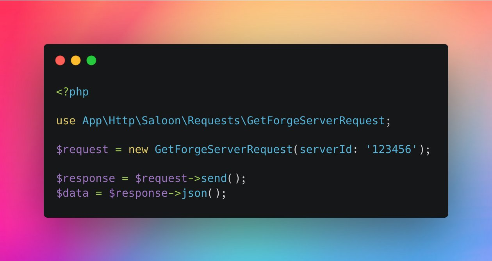

# 🚪 Saloon

### Introduction

Saloon offers a fluent, object-oriented wrapper to build your next API integration or PHP SDK. It makes sharing API requests throughout your application a breeze. You don’t have to configure a HTTP client, so you can start sending requests really quickly.

If you need request faking for your tests, Saloon has it out of the box alongside many other useful tools like OAuth2 boilerplate and caching. If you use Laravel, there's also a dedicated Laravel package with artisan console commands to help you build even faster.

### Features

* Simple, easy to learn syntax that standardises the way you interact with APIs
* Abstract API integrations into classes so you can keep your code DRY
* Configuration is fast and can be shared across all your requests
* Built on top of Guzzle, one of the most popular PHP HTTP clients.
* Framework agnostic
* Mocking requests for testing
* Great for building your own PHP SDKs
* Authentication & OAuth2 boilerplate already built for you
* Scalable with lots of API integrations across many team members


Like the sound of Saloon? Consider [giving it a star on Github](https://github.com/sammyjo20/saloon)!


### Why Saloon?

Building API integrations can be time consuming. After you have found an API client to use, you’re faced with lots of configuration to remember and it’s hard to repeat requests without copying and pasting, and then when you introduce patterns like OAuth2 everything gets complicated. You’ll often find yourself writing the same boilerplate code over and over again.&#x20;

We’ve standardised the way we talk to APIs with PSR-7 and PSR-18 but we haven’t got a standard structure to build API integrations.

Saloon aims to solve this.
